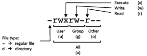

# Linux command line cheat sheet

## Basic
| Command | Description |
| ----------- | ----------- |
| **pwd** | displays the full path to the current directory (folder) |
| **cd** | change a directory |
|| `cd /` changes a directory to root|
|| `cd /home` or `cd ~` changes a directory to a home as absolute path |
|| `cd orifjon` or `cd ./orifjon` change a directory that in a current directory |
|| `cd ..` change a directory to a parent directory |
||Note|
||`./` currect directory|
||`../` up or parent directory|
||`/` root directory directory|
||`~` home directory|
|**ls**|shows all details and list of directory and files in a current directory|
||`ls` list of directory and files in a current directory|
||`ls -l` more information|
||`ls -r` reverse order|
||`ls -lr` or `ls -l -r` more an reverse order list|
||`ls -p` type|
||`ls -s` sort|
||`ls ~/Documents -r -d` |
||`ls --help` List information |
&nbsp;

## Administrative privileges

| Permissions | Commands example
|---------|-----------|
| U   G   W | | 
|rwx rwx rwx |    chmod 777 file.txt |
|rwx rwx r-x |    chmod 775 file.txt |
|rwx r-x r-x |    chmod 755 file.txt |
|rw- rw- r-- |    chmod 664 file.txt |
|rw- r-- r-- |   chmod 644 file.txt |

    U = User
    G = Group
    W = World

    r = Read
    w = write
    x = execute
    - = no access

## Package manager (apt-get) to install new applications